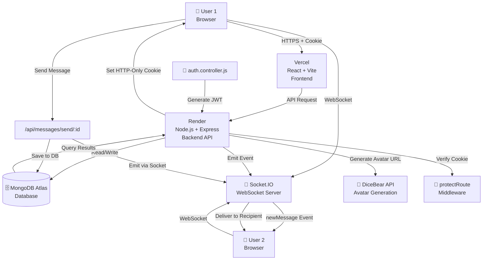
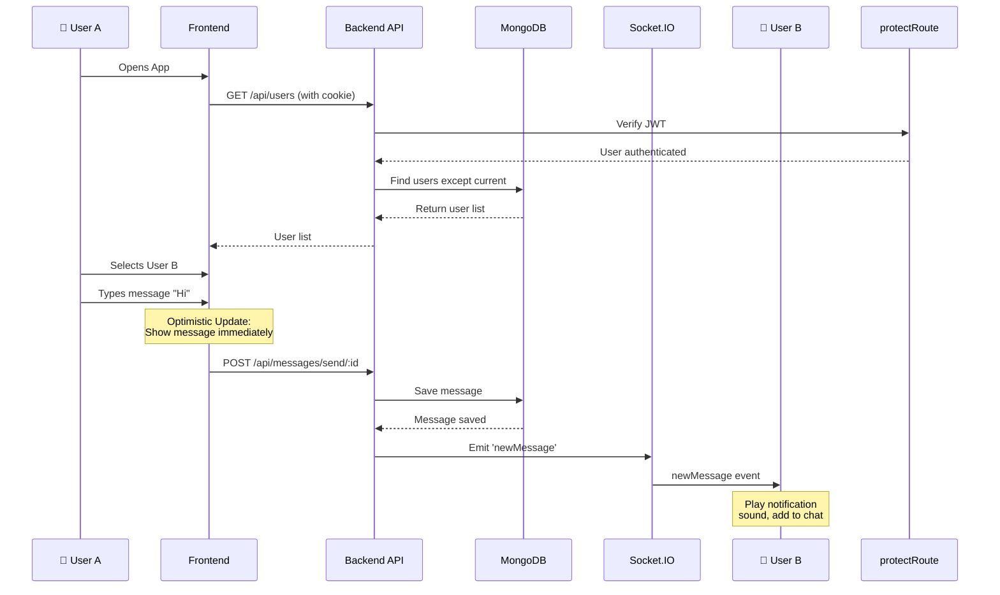

# System Design Diagram(Architecture)

```mermaid
graph TD
    %% Clients
    User1[👤 User 1<br/>Browser] 
    User2[👤 User 2<br/>Browser]
    
    %% Frontend
    Frontend[Vercel<br/>React + Vite<br/>Frontend]
    
    %% Backend
    Backend[Render<br/>Node.js + Express<br/>Backend API]
    
    %% Database
    MongoDB[(🗄️ MongoDB Atlas<br/>Database)]
    
    %% Real-time
    SocketIO[🔌 Socket.IO<br/>WebSocket Server]
    
    %% External Services
    DiceBear[🎨 DiceBear API<br/>Avatar Generation]
    
    %% User1 Flow
    User1 -->|HTTPS + Cookie| Frontend
    Frontend -->|API Request| Backend
    Backend -->|Verify Cookie| protectRoute[🔐 protectRoute<br/>Middleware]
    
    %% Database Flow
    Backend -->|Read/Write| MongoDB
    MongoDB -->|Query Results| Backend
    
    %% Socket.IO Flow
    User1 -->|WebSocket| SocketIO
    User2 -->|WebSocket| SocketIO
    Backend -->|Emit Event| SocketIO
    SocketIO -->|newMessage Event| User2
    
    %% Avatar Service
    Backend -->|Generate Avatar URL| DiceBear
    
    %% Auth Flow
    AuthController[📝 auth.controller.js] -->|Generate JWT| Backend
    Backend -->|Set HTTP-Only Cookie| User1
    
    %% Message Flow
    User1 -->|Send Message| MessageAPI["/api/messages/send/:id"]
    MessageAPI -->|Save to DB| MongoDB
    MessageAPI -->|Emit via Socket| SocketIO
    SocketIO -->|Deliver to Recipient| User2
```

```mermaid
sequenceDiagram
    participant User as 👤 User A
    participant FE as Frontend
    participant API as Backend API
    participant DB as MongoDB
    participant Socket as Socket.IO
    participant UserB as 👤 User B

    User->>FE: Opens App
    FE->>API: GET /api/users (with cookie)
    API->>protectRoute: Verify JWT
    protectRoute-->>API: User authenticated
    API->>DB: Find users except current
    DB-->>API: Return user list
    API-->>FE: User list

    User->>FE: Selects User B
    User->>FE: Types message "Hi"
    
    Note over FE: Optimistic Update:<br/>Show message immediately
    
    FE->>API: POST /api/messages/send/:id
    API->>DB: Save message
    DB-->>API: Message saved
    API->>Socket: Emit 'newMessage'
    Socket->>UserB: newMessage event
    
    Note over UserB: Play notification<br/>sound, add to chat
```